<h1 align="center" > Food Paradise </h1>
                                                        

## **Project Summary**:

Food Blogging is one of the best blog to get into because there are so many different topics you could write about and everyone has to eat! Our Project "Food Paradise" is Based on Food Blogging.We used html,css,javascript,bootstrap in frontend to make it responsive and php, codeigniter,mysql in backend to make our project easy to use.
This Project could help people learn how to cook a specific type of cuisine with an instructional info filled with how-to articles, recipe reviews, technique and video demos.

## **Goals**:

Our main goal is to present the project in simple and organized way.A Food Blogging Project is Very Useful at Present World.We Focus On Different Culture Foods of various Categroies.Also There Are Various Food Recipes, Articles,Video Tutorials which can help a User to Learn Cooking Very Effectively. From This Project A Normal User Can Get Clear Ideas of Foods & Cooking.

## **Benefits**:

This Project Helps You To Get Better Knowledge About Different Culture of Foods,Different Ways of Cooking,Gives Virtual Taste of Different Foods and Their Recipes.A User Can Post Recipes,Reviews And Articles of their Respective Foods and Everyone can increases their knowledge about foods by themselves.By Seeing Our Project Videos Recipe People will be Able to Make Delicious Foods From Home.

## **Tools**:

* HTML
* CSS
* Bootstrap
* JavaScript
* JQuery
* PHP
* CodeIgniter
* MySQL

## **Project Features**:

* Full Responsive 
* User Sign in/ Sign up option 
* Food Related Info, Videos, Photos.
* Learning Section: user can learn about cooking and recipe.
* Provides Technical Support.
* Admin Panel/Author Services.
* Different Categories for Easy Accessing.
* User Can Get Their Desired Services from Services Section
* Create, Read, Update and Delete system in Services Section
* Searching Option In the List
* Pdf and Printing of Receipt 

## **User Interface**:

  <b>Registration Form</b> 
    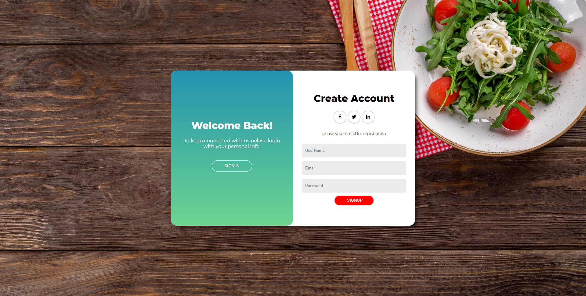
   <b> User Login</b> 
    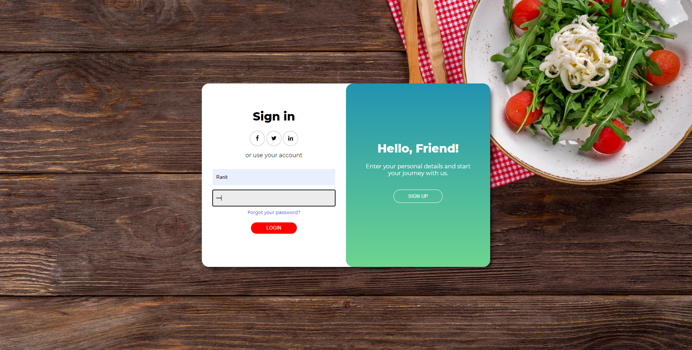
    <b> After Login</b> 
    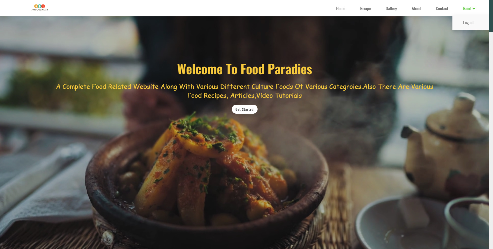
    <b> HomePage</b> 
    
    <b> Recipes</b> 
    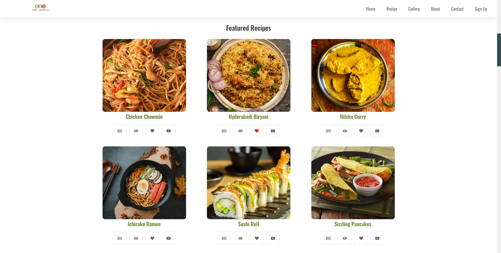
    <b> Gallery</b> 
    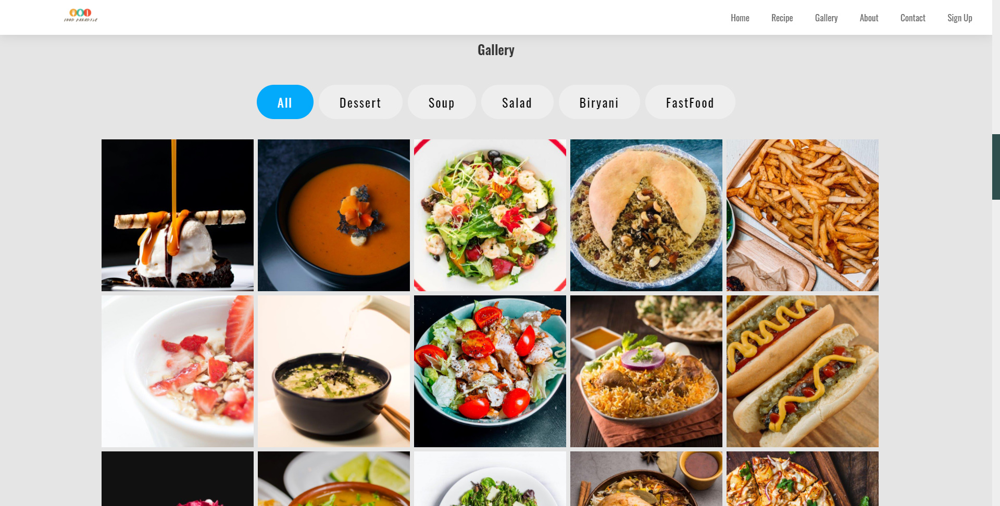
    <b> Filter Dessert</b> 
    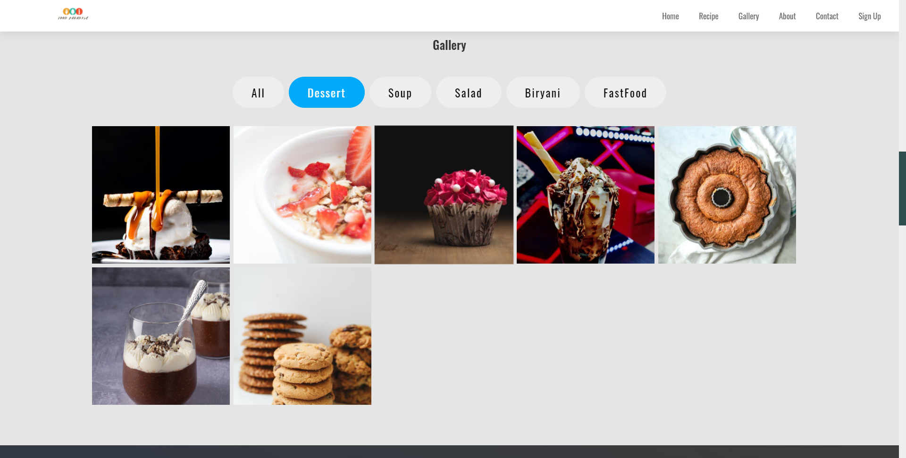
    <b> About Us</b> 
    
    <b> Contact Us</b> 
    
    <b> Services</b> 
    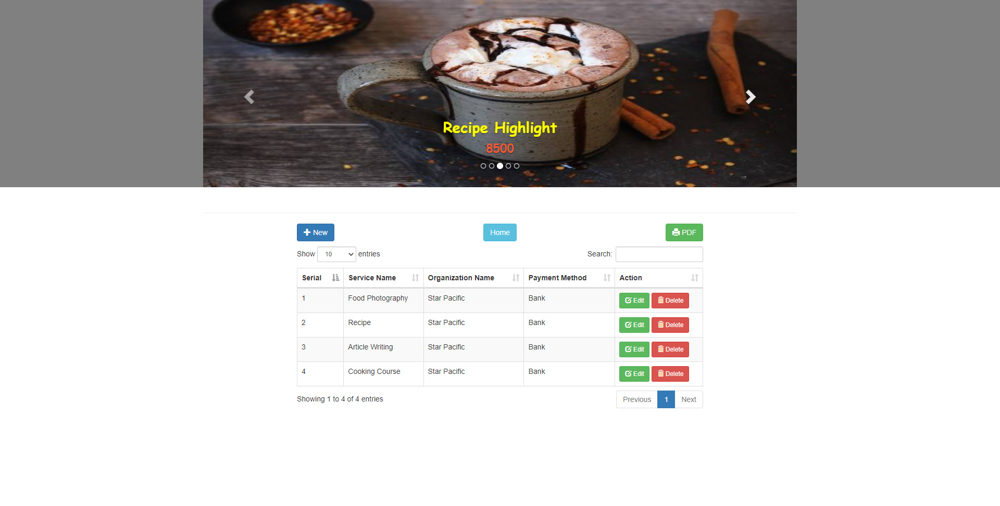
    <b> Add Services</b> 
    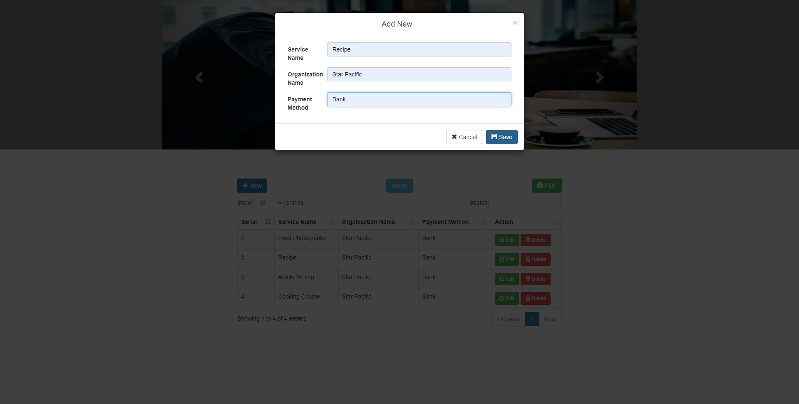
    <b> Edit Services</b> 
    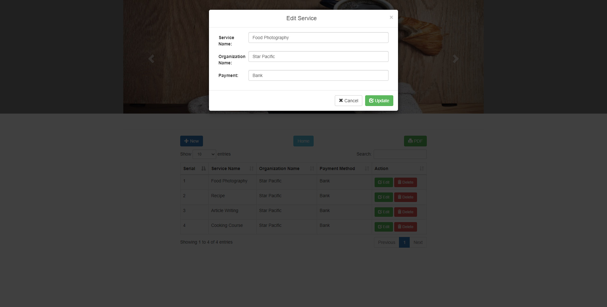
    <b> Delete Services</b> 
    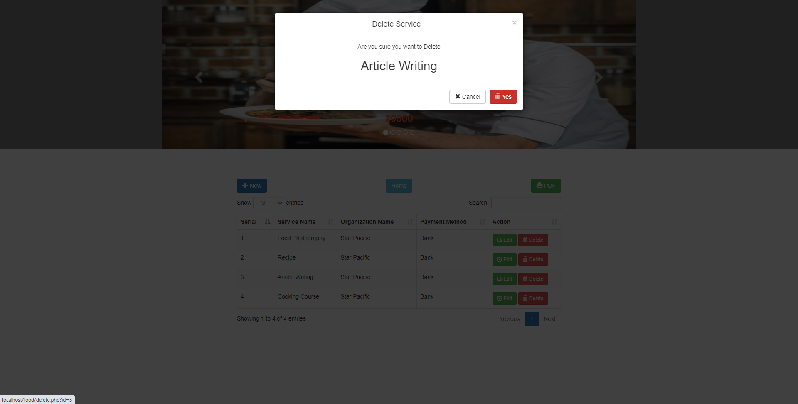
    <b> Search</b> 
    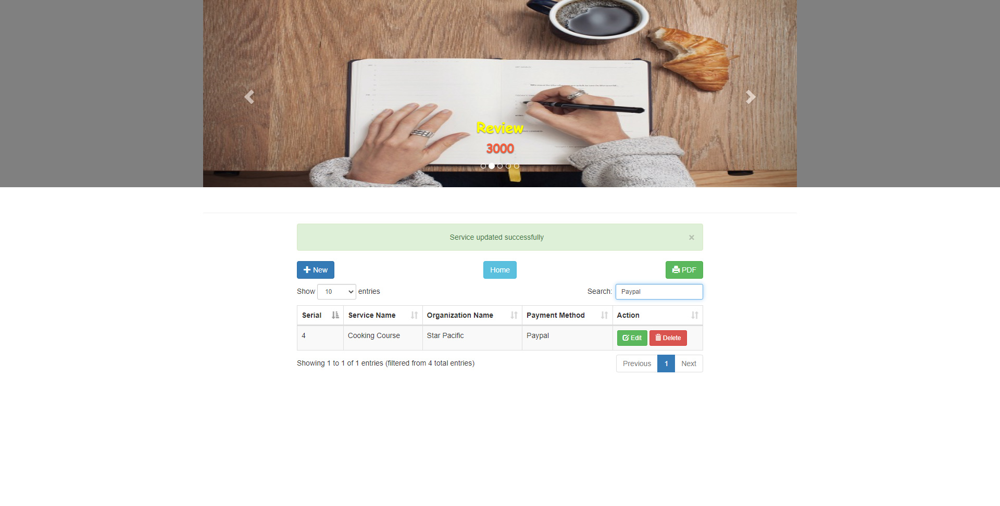
    <b> Pdf Receipt</b> 
    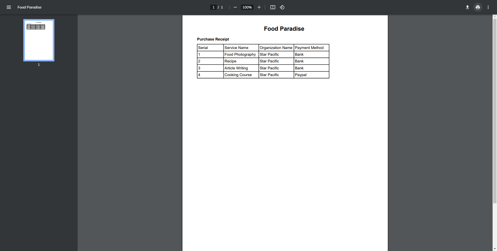

## **Conclusion**:

The Result Of this Project Would be An Attractive,Adaptable, and Easy-To_Use with a target audience of Foodies & Food Bloggers.We Believe Our Attention To Detail And Sense Of Responsibility Give this project a Good Chance of Succeeding.
